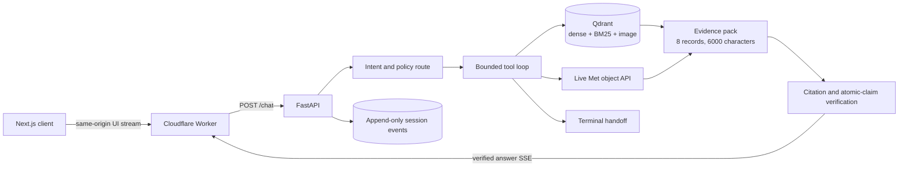

# Met Collection Agent

An independent, source-grounded assistant for The Metropolitan Museum of Art's Open Access collection and visitor information.

[](https://github.com/AjayKasu1/met-collection-agent/actions/workflows/ci.yml)
[](https://codespaces.new/AjayKasu1/met-collection-agent?quickstart=1)
[](LICENSE)

The API, Worker bundle, and container images are verified in CI. The production profile uses Turnstile, an edge rate-limit binding, a shared edge-to-origin credential, managed PostgreSQL audits, dependency readiness checks, and monitored rollback paths. See the [deployment runbook](docs/deploy.md) and [operations guide](docs/operations.md).

## What makes this different

- Factual text is released only after the server matches citations to retrieved evidence and checks every atomic claim. Failed checks get one bounded repair, then fail closed.
- A versioned non-interpretive policy refuses requests for artistic meaning, quality, or ranking while allowing documented facts and attributed curatorial text.
- The reviewed CI baseline passes 9 of 10 end-to-end cases with mean independent faithfulness 1.00. Reports retain answers, routes, citations, latency, token use, cost estimates, and failure reasons.

## Architecture



The text index contains 20,000 public-domain objects embedded with multilingual E5 at 1,024 dimensions. The image vector is The Met's published SigLIP 2 embedding and covers 19,964 objects. Visitor information comes from captured public pages with canonical URLs and capture timestamps. See the [request lifecycle and event log](docs/architecture.md) and the [architecture decisions](docs/adr/README.md).

## Latest reviewed evaluation

The latest complete reviewed report is `2026-09-05T031955-21bf3af5-quick`. It used a 300-second batch deadline to accommodate free-tier pacing. The current interactive deadline is 120 seconds and interactive pacing is disabled.

| Metric | Measured result |
| --- | ---: |
| End-to-end pass rate | 90% (9/10) |
| Collection lookup | 100% (2/2) |
| Refusal and handoff | 100% (6/6) |
| Hallucination traps | 50% (1/2) |
| Mean independent faithfulness | 1.00 (10 judged) |
| Mean latency | 26.348 s |
| p95 latency | 98.623 s |
| Mean answer-path model cost | $0.0002823075 |
| Independent judge cost | $0.0008523750 total |

The failed Mona Lisa trap was rejected by the production grounder because this workspace could not prove an external location. It returned no unchecked factual answer. See [evaluation design and row-level results](docs/evals.md).

## Quickstart

Install Docker Desktop and Git, then run from the repository root:

```sh
cp .env.example .env
```

Set these local values in `.env` for the recommended cross-provider routing:

```dotenv
GEMINI_API_KEY=
GROQ_API_KEY=
LLM_MODEL=gemini/gemini-3.8-flash
LLM_MODEL_LITE=gemini/gemini-3.1-flash-lite
LLM_MODEL_MAIN_FALLBACK=groq/openai/gpt-oss-120b
LLM_MODEL_LITE_FALLBACK=groq/openai/gpt-oss-20b
LLM_FALLBACK_ENABLED=true
HF_DATASET_REPO=AJAYKASU/met-collection-index
```

Place the provider keys after their names and keep them only in the ignored local file. Keep the checked-in local embedding defaults. Then start the complete stack:

```sh
make demo
```

`make demo` starts Qdrant, waits for readiness, restores the verified snapshot without recomputing embeddings, builds the API and local web images, and opens services on loopback. Visit [http://localhost:3000](http://localhost:3000). The first semantic query downloads the pinned local model weights, about 2.24 GB.

For host-based development, install [uv](https://docs.astral.sh/uv/getting-started/installation/), then run `make setup`, `make qdrant`, `make seed`, `make dev`, and `make web-dev`. Run all offline quality gates with `make check-all`.

## MCP usage

The MCP server and HTTP agent share the same validation and tool registry:

```sh
uv run --project api --locked met-agent-mcp
uv run --project api --locked met-agent-mcp --transport sse --port 8001
```

It exposes six tools:

| Tool | Purpose |
| --- | --- |
| `search_collection` | Hybrid factual search over the prepared collection |
| `get_object` | Live object details, including current gallery and display status |
| `search_visitor_info` | Search captured visitor pages with freshness metadata |
| `find_similar_objects` | Image-vector similarity using The Met's published embeddings |
| `get_directions` | Live bounded routes from The Great Hall to a numbered gallery using The Met's official interactive map |
| `handoff` | Terminal routing for account, purchase, and out-of-scope requests |

See [MCP client configuration](docs/mcp.md).

## Project layout

```text
api/
  src/met_agent/
    agent/                 Bounded loop, evidence packing, append-only events
    guardrails/            Intent, non-interpretive policy, grounding checks
    ingestion/             Sources, checkpoints, verification, snapshots
    llm/                   Provider routing, pacing, structured output, costs
    mcp/                   Stdio and SSE transports
    observability/         Redacted logs and optional Langfuse traces
    retrieval/             Dense, BM25, image, fusion, and local reranking
    tools/                 Six typed tools shared by HTTP and MCP
    config.py              Sole environment-loading boundary
    main.py, routes.py     FastAPI factory and verified SSE routes
  prompts/                 Versioned runtime instructions and hashes
  scripts/                 Ingest, verify, publish, seed, and privacy checks
  tests/                   Offline and local Qdrant integration tests
web/                       Next.js client and OpenNext Workers adapter
evals/                     Typed golden set, runner, reports, reviewed baseline
docs/                      Architecture, ADRs, operations, and limitations
.github/workflows/          CI, GHCR release, and guarded Worker deployment
.devcontainer/              Python 3.12, Node 20, Docker, and forwarded ports
docker-compose.yml          API, web, and pinned Qdrant services
```

## Limitations

- The public demo uses bot verification and a per-location edge rate limit. It does not provide user accounts, tenant isolation, or identity-based quotas.
- Interactive token pacing is disabled. Groq free-tier limits can still reject bursts; paid capacity and account-level monitoring are required for a launch SLO.
- Collection search stores gallery values from ingestion time. Only `get_object` checks the live object record, cached for at most five minutes.
- Visitor answers reflect captured pages and show their capture time. A weekly blue-green refresh is available, but source publication delays still prevent a guarantee of today's hours, policies, or exhibition status.
- PostgreSQL is the required production audit store. SQLite remains the local single-process development fallback.
- The 20,000-object selection and reviewed golden set are regression assets, not a complete or held-out museum benchmark.

The full [limitations and production controls](docs/limitations.md) document covers data policy, latency measurements, authentication, human review, monitoring, and deployment requirements.

## Acknowledgments

Collection metadata comes from The Metropolitan Museum of Art's [Open Access repository](https://github.com/metmuseum/openaccess), under CC0. Image embeddings come from The Met's [SigLIP 2 dataset](https://huggingface.co/datasets/metmuseum/openaccess-embeddings-siglip2), also CC0, at revision `45fe67456ef1cffbe5ba801d5cd341fcf31cd806`. This project is a modified derivative: it joins, normalizes, filters, and embeds source records; it does not compute image vectors. Snapshot manifests record source revisions, model identities, dimensions, coverage, and artifact hashes.

The Met's dataset card asks downstream users to identify modifications, retain attribution, avoid trademark misuse, and avoid implying endorsement. This project follows that guidance, does not use museum logos as branding, and is not affiliated with or endorsed by The Metropolitan Museum of Art. Visitor website extracts retain their original ownership and are not covered by the collection dataset's CC0 license. Source code is MIT licensed.
