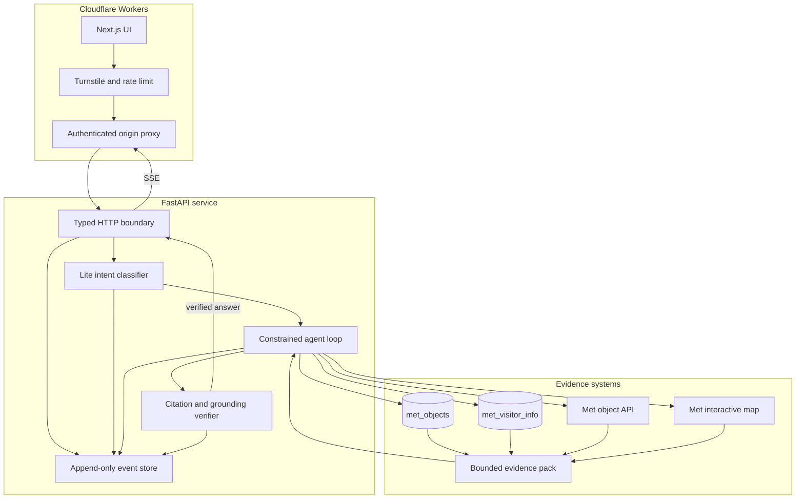

# Architecture and request lifecycle

The system separates source acquisition, retrieval, reasoning, verification, and presentation. The model never writes directly to a browser stream and never receives provider credentials. The API releases factual text only after evidence and policy checks finish.

## Runtime components



Qdrant collection metadata records the text embedding provider, model, dimension, schema version, and image-vector provenance. Every query validates that identity before embedding or searching. Snapshot restore repeats those checks and compares every source payload and published image vector.

## Factual request lifecycle

1. The web route validates the UI message, sends the latest question and stable session UUID to `POST /chat`, and accepts no client-provided citations.
2. FastAPI validates the request and appends `user_message` plus the hashes of all active prompt versions.
3. The lite model classifies language, category, operation, gallery entity, origin, search rewrite, and optional handoff target with native structured output using `intent_v4`. The same call handles colloquial wording and spelling variation; there is no phrase-matching router or additional embedding model. The server checks the proposed operation, category, difficulty, language, and numeric entity before dispatching a bounded gallery handler. A gallery ID must match the only numeric entity in the current message and be explicitly identified as a gallery or room. The remaining short regex validates that entity reference, not the requested operation. Ambiguous, filtered, combined, or unsupported requests remain general requests.
4. Interpretive requests return the versioned policy response. Out-of-scope requests call the terminal `handoff` tool. Factual requests enter the bounded loop.
5. The main or lite model may call only a registered JSON-schema tool. Arguments are strictly validated, calls run sequentially, and the loop stops after six tool calls.
6. Search combines local multilingual E5 dense vectors with Qdrant BM25, fuses candidates, and reranks the top 20 with a pinned local cross-encoder. Model context keeps at most eight unique evidence records and 6,000 source-text characters. A validated simple visitor-information intent dispatches directly to `search_visitor_info`; it does not spend model calls selecting an already-known tool. Answer generation and the independent grounding check remain separate.
7. `get_object` reads The Met's live object endpoint for current display and gallery fields. `find_similar_objects` searches only the published `image` vector and never substitutes text similarity. A narrowly recognized route request can call `get_directions`, which resolves an exact Floor 1 gallery through The Met's live interactive map and uses The Great Hall as the indoor route origin. When the user omits the entrance, the answer discloses that it is assuming the Fifth Avenue entrance.
8. Final generation uses provider-native JSON Schema. Citation URLs and verbatim excerpts must match evidence returned during the same turn.
9. A separate structured grounding call checks atomic claims against the same bounded evidence. One rejected draft may be regenerated without new tools. A second failure returns a verification-unavailable answer.
10. Only the verified final text is emitted as SSE token events. The browser compares the emitted text with the typed final answer before attaching citations or provenance.

The API sends a comment heartbeat every 15 seconds while verification is still running. This keeps intermediaries from closing the connection without exposing an unchecked draft.

## Event log

Each turn has a session UUID and turn UUID. Production uses PostgreSQL with pooled connections, atomic per-turn appends, a monotonic sequence, and database triggers that reject updates and deletes. A transaction-scoped retention procedure is the only delete path. SQLite provides the same append-only contract for local single-process development. The store redacts configured secret values, credential-like strings, and secret-shaped fields before serialization.

Typical multi-hop factual turns append this sequence:

```text
user_message
prompt_versions
model_request
model_response
intent
model_request
model_response
tool_call
tool_timing
tool_result
evidence_context
model_request
model_response
guardrail
final_answer
```

Retries, cooldowns, fallback selection, validation errors, tool limits, terminal handoffs, and turn errors add explicit events when they occur. Provider response bodies and authorization headers are never recorded. Event data can still contain user questions, model-visible evidence, and final answers, so it requires the same access and retention controls as conversation data.

An unverified general-route answer with a classified gallery or a numeric entity emits `routing_deviation` to the session audit and structured warning logs. It includes the operation, category, and session/turn identifiers; raw questions remain in the protected session audit. This is a review signal, not proof of a routing defect: years and object IDs can also trigger it. No email is sent and no test labels are changed automatically.

`GET /sessions/{session_id}/events?after=0&limit=200` returns the ordered audit trail. `after` provides a stable cursor and `limit` is bounded from 1 through 500. Tests exercise multi-hop tool calls and assert that tool, evidence, guardrail, and final-answer events remain ordered and share the same turn. In production the API route requires the same edge-to-origin credential as other data routes; the public browser proxy does not expose arbitrary credentials.

Application request logs are separate. They include request ID, route template, method, status, and elapsed time while omitting raw paths, query strings, headers, and bodies.

## Failure behavior

Client validation failures return bounded 4xx responses. Provider access errors do not trigger fallback; the model is quarantined for operator review. Timeouts, rate limits, and 5xx responses have bounded retries with jitter and may use an explicitly enabled configured fallback. Missing fallback credentials disable that route at startup. The complete answer path has a deadline and returns a safe temporary failure when verification cannot finish.

Tool errors are typed as invalid arguments, unknown tool, unavailable upstream, or confirmed not found. A confirmed Met API 404 can produce a deterministic cited not-found answer. Other source failures cannot be restated as facts.
